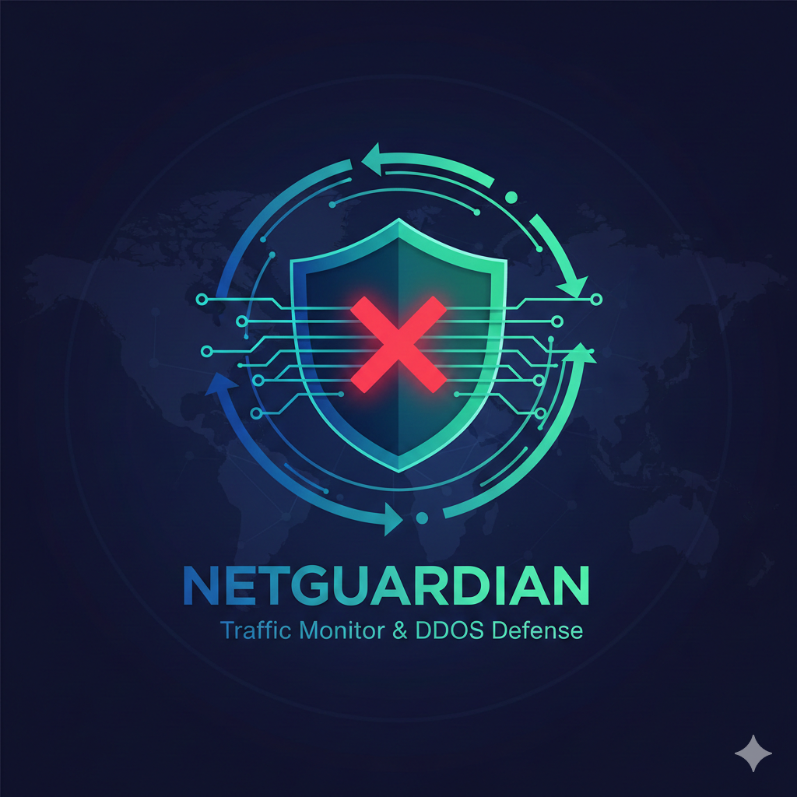
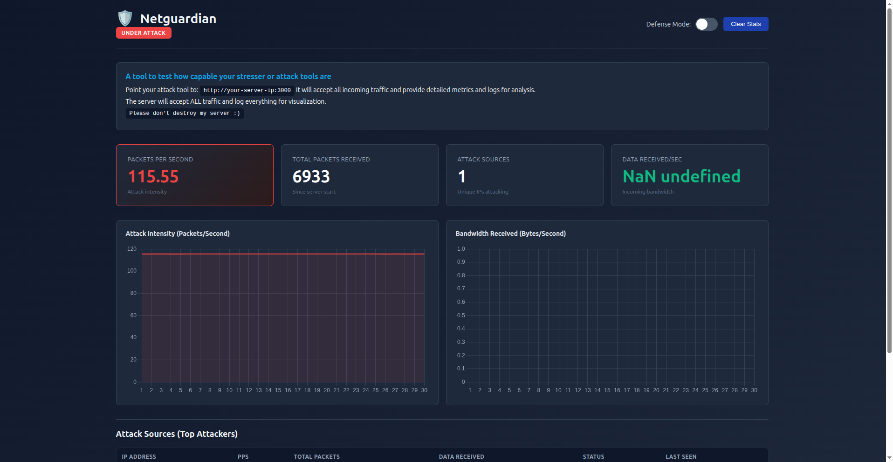

<div align="center">



# Netguardian

**Real-time Network Traffic Monitoring & Analysis Dashboard**

[](https://github.com/PromSereyreaksa/netguardian/stargazers)
[](https://github.com/PromSereyreaksa/netguardian/network/members)
[](https://github.com/PromSereyreaksa/netguardian/watchers)
[](LICENSE)




[Features](#features) • [Getting Started](#getting-started) • [Roadmap](#roadmap) • [Tech Stack](#tech-stack)

</div>

---

## Project Status

> **Work In Progress**
> 
> The dashboard visuals and core metrics are now implemented. Current work focuses on reliably **receiving and observing traffic from different request methods**, then gradually integrating the **correct layered tech stack** to handle traffic beyond standard HTTP. At this stage, Netguardian acts as a **traffic sink and observer**, not a full mitigation system.

```
Development Progress
━━━━━━━━━━━━━━━━━━━━━━━━━━━━━━━━━━━━━━━━━━━━━━━━━━

Dashboard UI Implementation        ████████████████████ 100%
Core Metrics Collection            ████████████████████ 100%
Real-time Visualization            ████████████████████ 100%
Multi-method Request Handling      ████████████░░░░░░░░  65%
Layer 4 Integration                ████░░░░░░░░░░░░░░░░  20%
Defense Mode                       ░░░░░░░░░░░░░░░░░░░░   0%

Overall Progress                   ██████████░░░░░░░░░░  50%
```

## Overview

Netguardian is a network security monitoring dashboard designed to **observe, count, and visualize incoming traffic in real time**. It provides insight into request rates, active sources, and traffic behavior, with the goal of understanding how different tools and methods interact with a target service.

> This project is for **learning and testing your stresser (attack tools) only**.

## Features

**Real-time Traffic Monitoring**
- Live request tracking and analysis
- Packets-per-second (PPS) metrics
- Active source (IP) overview
- Request method distribution

**Visualization Dashboard**
- Interactive charts and graphs
- Traffic flow tables
- Historical data trends
- Real-time metric updates

**Metrics API**
- RESTful API endpoint for data consumption
- JSON-formatted traffic statistics
- Dashboard polling integration

**Defense Mode (WIP)**
- Toggle-based protection system
- Rate limiting capabilities
- Request filtering options

## Tech Stack

[](https://nodejs.org/)
[](https://expressjs.com/)
[](https://developer.mozilla.org/en-US/docs/Web/JavaScript)
[](https://developer.mozilla.org/en-US/docs/Web/HTML)
[](https://developer.mozilla.org/en-US/docs/Web/CSS)

**Backend**
- Node.js
- Express.js

**Frontend**
- HTML5
- CSS3
- Vanilla JavaScript
- Chart.js (for visualizations)

**Network Layer**
- Operating at Layer 7 (Application Layer)
- Planned Layer 4 (Transport Layer) integration

## Getting Started

### Prerequisites
- Node.js (v14 or higher)
- npm or yarn

### Installation

1. Clone the repository
```bash
git clone https://github.com/PromSereyreaksa/netguardian.git
cd netguardian
```

2. Install dependencies
```bash
npm install
```

3. Start the server
```bash
npm start
```

4. Open the dashboard
```
http://localhost:3000/dashboard
```

## How It Works (Current)

Netguardian is currently built on Node.js + Express and operates at the application layer (Layer 7).

**Traffic Processing Flow**
- The server listens on port 3000 and accepts any HTTP request method (GET, POST, HEAD, custom methods, etc.)
- All incoming requests are routed through a catch-all traffic sink that:
  - Counts total requests
  - Tracks request rate over time (PPS)
  - Records basic per-IP activity
- A metrics API (`/api/metrics`) exposes this data to the dashboard
- The dashboard polls the API and updates visuals in near real time

**Current Limitations**

At this stage, Netguardian observes requests, not raw packets. Lower-level traffic (TCP, UDP, ICMP) is handled by the OS kernel and will be integrated later using the appropriate tooling.

## Roadmap

### Phase 1: Solidify Layer 7 (HTTP) Traffic Handling

- Ensure all HTTP methods are accepted and logged (GET, POST, HEAD, OPTIONS, and uncommon/custom methods)
- Record additional request metadata:
  - Method
  - Path
  - Headers size
  - Body size
  - Request duration
- Improve rate calculation using sliding windows instead of simple averages
- Distinguish between:
  - Fast bursts
  - Sustained high-rate traffic
  - Slow or long-lived requests

### Phase 2: Separate "Dashboard Traffic" from "Observed Traffic"

- Exclude `/dashboard` and `/api/*` routes from global traffic counters
- Prevent self-polling from inflating PPS values
- Maintain a clean boundary between:
  - Control plane (dashboard + API)
  - Data plane (incoming traffic sink)

### Phase 3: Prepare for Layer 4 Visibility (Non-HTTP)

- Accept that Express cannot see TCP/UDP/ICMP packets directly
- Start collecting system-level network stats from the OS:
  - Active TCP connections
  - New connection rate
  - UDP packet counts
- Expose these values to the dashboard as external metrics, not requests

### Phase 4: Introduce Layer Awareness

- Classify traffic by observed layer:
  - Layer 7: HTTP requests handled by Express
  - Layer 4: Connection and packet statistics from the system
- Display this distinction clearly in the dashboard to avoid confusion
- Avoid labeling traffic as "attacks" — treat everything as observed events

### Phase 5: Improve Accuracy & Performance

- Move in-memory counters to ring buffers or rolling windows
- Optimize request handling to reduce overhead during high traffic
- Add safeguards so metrics collection does not become a bottleneck itself

### Phase 6: Defense Mode (Later Stage)

- Start with passive detection only (flags, warnings, indicators)
- Add optional, clearly labeled mitigation logic:
  - Rate limiting
  - Temporary request rejection
- Keep defense logic modular and easy to disable

### Phase 7: Documentation & Safety

- Clearly document:
  - What Netguardian can observe
  - What it cannot observe
  - Which OSI layers are covered at each stage
- Emphasize learning, monitoring, and visualization over enforcement

## Project Structure

```
netguardian/
├── public/
│   ├── logo.png              # Project logo
│   ├── pic-1.png             # Dashboard screenshot
│   └── dashboard/            # Dashboard assets
├── src/
│   ├── server.js             # Express server
│   ├── routes/               # API routes
│   ├── middleware/           # Traffic sink & metrics
│   └── utils/                # Helper functions
├── package.json
└── README.md
```

## Contributing

Contributions are welcome.

1. Fork the repository
2. Create a new feature branch (`git checkout -b feature/amazing-feature`)
3. Make your changes
4. Commit your changes (`git commit -m 'Add some amazing feature'`)
5. Push to the branch (`git push origin feature/amazing-feature`)
6. Submit a pull request

Please ensure your changes are tested and align with the project's learning-focused goals.

## Developer

**Prom Sereyreaksa**

## License

This project is licensed under the MIT License - see the [LICENSE](LICENSE) file for details.

## Disclaimer

This tool is designed for **educational purposes and authorized security testing only**. Users are responsible for ensuring they have proper authorization before testing against any network or system. The developers assume no liability for misuse of this software.

---

<div align="center">

Made for learning and ethical security research

</div>
